# Propagación de la señal Bluetooth de 2.4 GHz del llavero de alerta Ivy

*Física, Calor y Ondas — Universidad del Norte*

> ⚠️ **Este informe usa datos SIMULADOS.** Sirve para ver la estructura; los números reales salen de las mediciones.

## Resumen

Se caracterizó experimentalmente la propagación de la onda electromagnética de 2.4 GHz
que emite el llavero de alerta personal Ivy (ESP32, Bluetooth Low Energy, +9 dBm), midiendo
la intensidad de señal recibida (RSSI) en un portátil en 5 experimentos:
distancia, obstrucción por el cuerpo humano, orientación, posición de la antena respecto a
la batería y alcance máximo. El exponente de pérdida medido fue *n* = 2.29 ± 0.20 (R² = 0.95). Los resultados se interpretan con la ecuación de
Friis, el modelo log-distancia con sombreado log-normal, la atenuación en dieléctricos con
pérdidas, la difracción por filo de cuchillo, el desvanecimiento de Rice y el modelo de dos
rayos, y justifican reglas concretas de diseño de la carcasa.

## 1. Introducción

Un llavero de alerta solo es útil si su señal llega al celular cuando más se necesita: con
el llavero en un bolsillo, en un morral o con el cuerpo de la persona en medio. Este trabajo
mide cómo se comporta la onda de 2.4 GHz en esas condiciones reales y usa la física de ondas
para explicar los resultados y tomar decisiones de diseño.

**Objetivo general.** Caracterizar la atenuación de la señal BLE del llavero y explicarla con
modelos físicos de propagación de ondas.

**Objetivos específicos.** (1) Medir el exponente de pérdida *n* del ambiente. (2) Cuantificar
la atenuación del cuerpo humano y contrastar absorción contra difracción. (3) Medir el patrón
de radiación. (4) Evaluar el efecto de la batería sobre la antena. (5) Determinar el alcance y
validar la predicción del modelo.

## 2. Marco teórico

El desarrollo completo, con fórmulas y referencias, está en `FISICA.md`. En síntesis:

| Fenómeno | Modelo | Resultado clave |
|---|---|---|
| Onda de 2.44 GHz | λ = c/f | λ = 12.3 cm |
| Espacio libre | Friis: FSPL = 20·log10(4πd/λ) | 40.2 dB a 1 m |
| Ambiente real | Log-distancia + sombreado X_σ | *n* y σ medidos |
| Tejido | Dieléctrico con pérdidas (Gabriel 1996) | δ = 2.23 cm, 3.9 dB/cm |
| Obstáculo | Fresnel-Kirchhoff, UIT-R P.526 | persona: ≈ 12 dB |
| Agua | Relajación de Debye | pico de absorción a 19 GHz, no a 2.45 |
| Piso | Dos rayos | quiebre a 33 m |
| Fluctuación | Desvanecimiento de Rice | factor K |
| Seguridad | SAR ≤ P/m | ≤ 0.8 W/kg (límite 2 W/kg) |

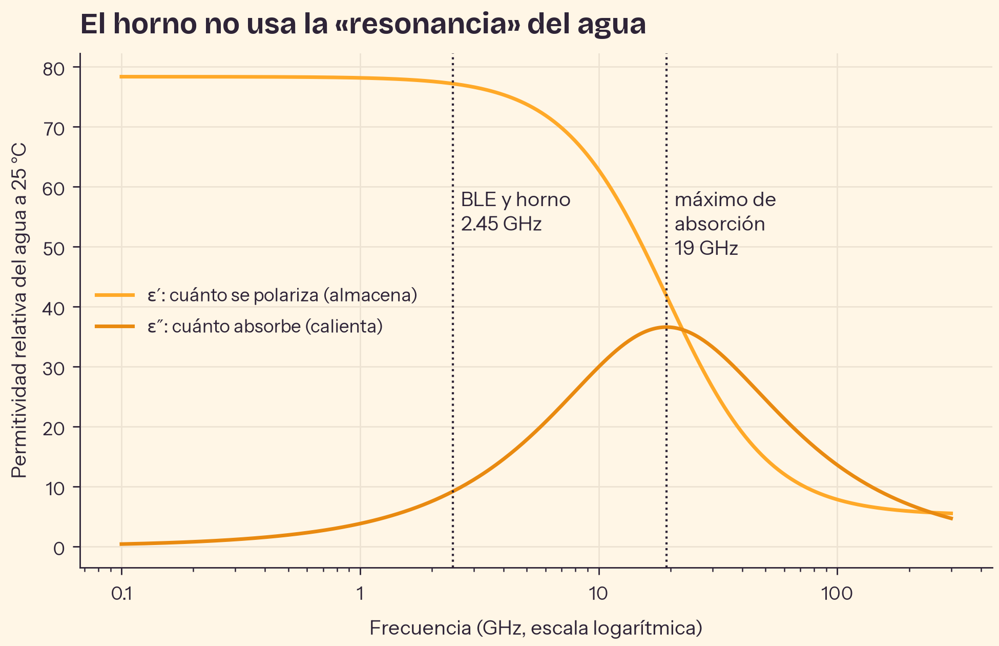

*Figura T1. Permitividad del agua (modelo de Debye).*

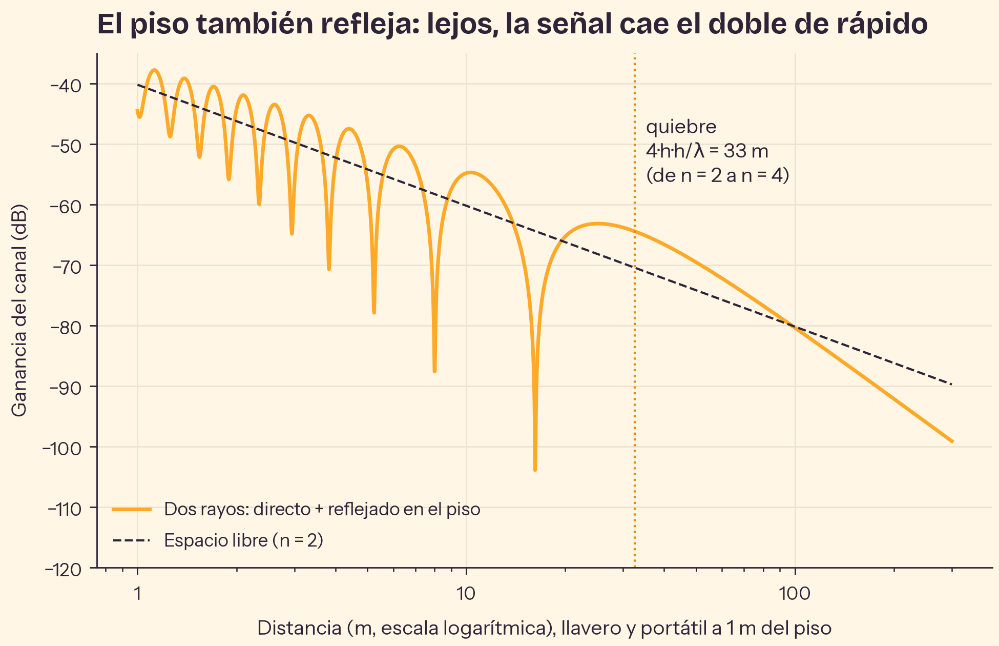

*Figura T2. Espacio libre contra el modelo de dos rayos.*

## 3. Metodología

El portátil registró con escaneo BLE activo cada anuncio del llavero (`GEOEXPO-ALERT`) durante
30 s por punto, guardando marca de tiempo y RSSI. El valor
de cada punto es la **mediana** de sus muestras. Montaje: llavero sobre soporte no metálico a
1.0 m y portátil a 1.0 m de
altura; lugar: pasillo; alimentación del llavero:
sin anotar; sistema: Linux-6.18.44-fc-v51-x86_64-with-glibc2.39.
El protocolo completo está en `PROTOCOLO.md`; los datos crudos (CSV) y metadatos (JSON),
en `datos/`.

## 4. Resultados

### 4.1 Atenuación con la distancia (E1)

Se ajustó el modelo log-distancia a 33 puntos (3 repeticiones):

| Parámetro | Valor |
|---|---|
| Exponente de pérdida *n* | 2.29 ± 0.20 (IC 95 %) |
| RSSI(1 m) | -54.9 ± 1.2 dBm |
| R² | 0.947 |
| σ del sombreado | 2.7 dB |
| Pérdidas del sistema frente a Friis ideal | 23.8 dB |

Interpretación de *n*: entre 2 y 3: interior con reflexiones y algunos obstáculos.

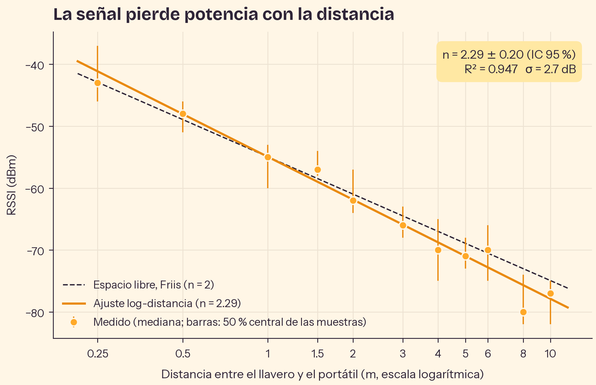

*Figura 1. RSSI contra distancia (escala logarítmica), ajuste y referencia de Friis.*

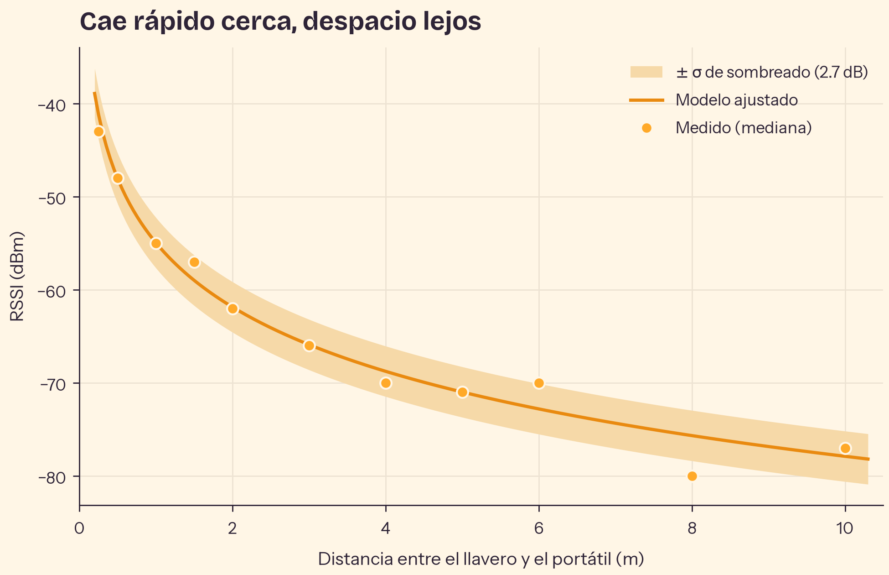

*Figura 2. La misma caída en escala lineal, con la banda de ±σ del sombreado.*

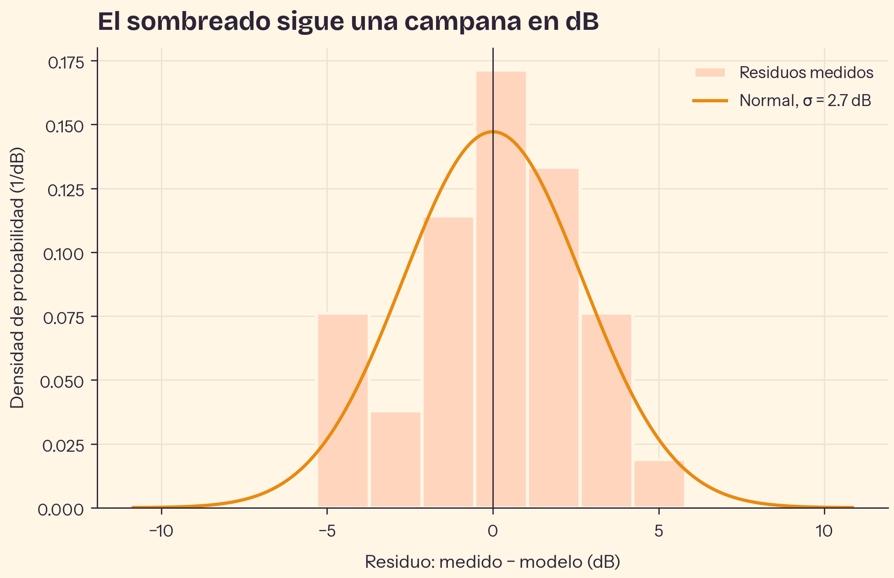

*Figura 3. Residuos del ajuste y la normal con σ medida: el sombreado es log-normal.*

**El RSSI como estimador de distancia.** Invirtiendo el modelo, el error típico fue de
18 % y la incertidumbre de ±1σ equivale a un factor ×/÷
1.31 sobre la distancia.

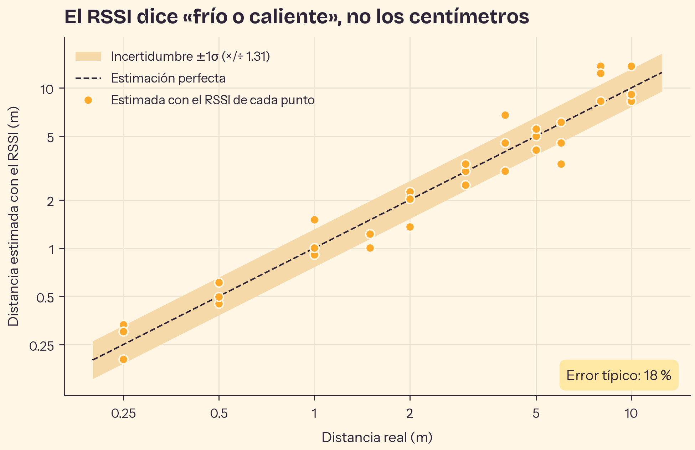

*Figura 4. Distancia estimada con el RSSI contra distancia real.*

### 4.2 El cuerpo como obstáculo (E2)

| Condición | RSSI (dBm) | Atenuación (dB) | K de Rice |
|---|---|---|---|
| Línea de vista | -62 | 0 | 11.7 |
| En la mano | -65 | 3 | 7.6 |
| Bolsillo del pantalón | -71 | 9 | 3.1 |
| Persona en medio | -80 | 18 | 0.6 |
| Dentro de un morral | -70 | 8 | 4.0 |

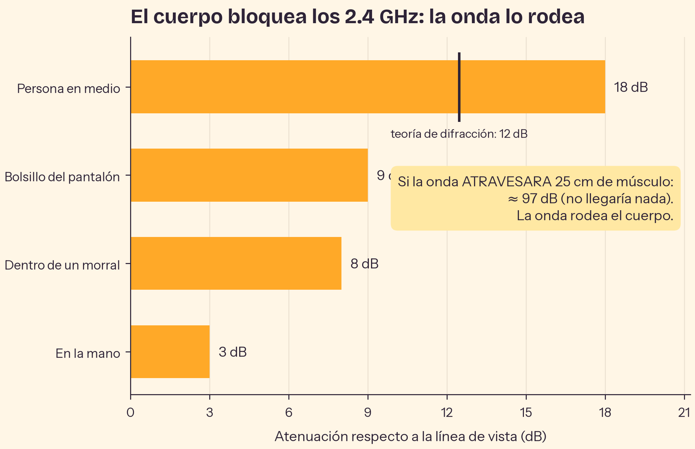

*Figura 5. Atenuación de cada obstáculo y predicción por difracción.*

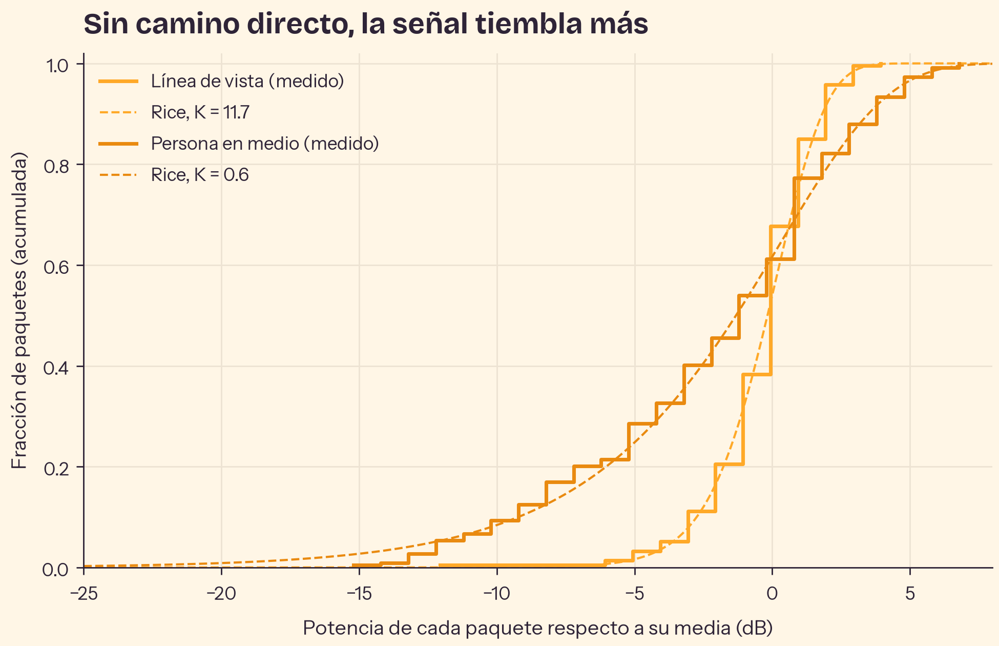

*Figura 6. Distribución de la potencia de los paquetes y ajuste de Rice.*

### 4.3 Patrón de radiación (E3)

La señal varió 11.0 dB con la orientación: máxima hacia 330°
y mínima hacia 210°.

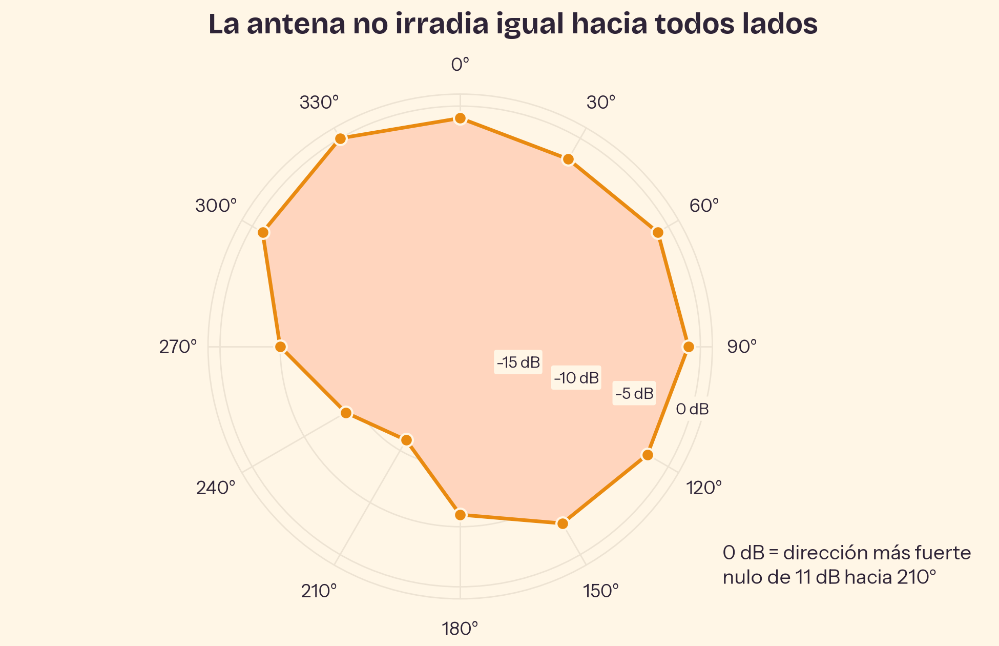

*Figura 7. Patrón de radiación medido (0 dB = dirección más fuerte).*

### 4.4 Antena y batería (E4)

| Posición | RSSI (dBm) | Diferencia (dB) |
|---|---|---|
| Antena sobresale (diseño final) | -62 | +0 |
| Antena encima de la batería | -71 | -9 |
| Sin batería cerca | -60 | +2 |

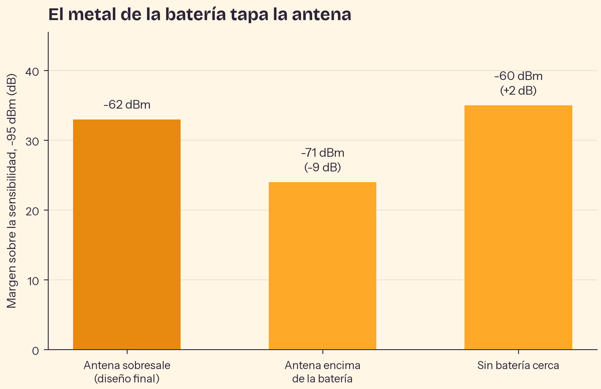

*Figura 8. Margen de enlace en cada posición de la antena.*

### 4.5 Alcance máximo (E5)

El último punto con señal estuvo a **72 m**. La tasa de paquetes cayó bajo el 50 % desde 50 m. El modelo de E1 predecía 56 m (error de +29 %).

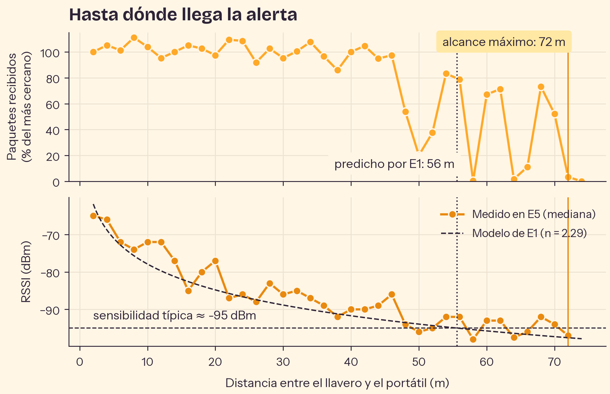

*Figura 9. Tasa de paquetes y RSSI contra distancia.*

## 5. Discusión

- **Exponente de pérdida.** *n* = 2.29 ± 0.20. El intervalo excluye a 2: el ambiente sí modifica la propagación (reflexiones y obstáculos). Las pérdidas del sistema (≈ 24 dB frente a Friis ideal) corresponden a antenas pequeñas, no ideales y con desacople de polarización.
- **Difracción contra absorción.** Una persona en medio atenuó 18 dB. Si la onda atravesara 25 cm de músculo (δ = 2.23 cm) perdería ≈ 97 dB; la difracción por los costados del cuerpo predice ≈ 12 dB. La medición es compatible con que la onda **rodea** el cuerpo, no que lo atraviesa. La zona de Fresnel en la mitad del enlace (r₁ = 25 cm) es del tamaño de un torso: por eso una persona la tapa casi por completo.
- **Desvanecimiento.** El factor K de Rice bajó de 11.7 con línea de vista a 0.6 con una persona en medio: sin camino directo, la señal llega solo por caminos dispersos y fluctúa más (tiende a Rayleigh).
- **Validación cruzada.** El modelo calibrado en E1 (hasta 10 m) predijo un alcance de 56 m y E5 midió 72 m. Extrapolar un factor ~6 fuera del rango de calibración es exigente. Que E5 llegue más lejos indica que su lugar propaga mejor que el de E1 (menos obstáculos) o que la sensibilidad real del portátil es mejor que −95 dBm.
- **Regla de diseño.** Con la antena encima de la batería la señal cambió -9 dB (87 % de la potencia perdida). La bolsa de aluminio de la LiPo refleja la onda y, por estar a menos de λ/4 de la antena, su corriente imagen cancela parte de la radiación. Se justifica que la antena sobresalga de la batería.

## 6. Conclusiones

- La señal del llavero sigue el modelo log-distancia; el ambiente queda resumido en *n* y σ.
- El cuerpo humano es prácticamente opaco a 2.4 GHz (δ ≈ 2 cm), pero la onda lo rodea por
  difracción: llevar el llavero pegado al cuerpo cuesta decenas de dB, no lo vuelve invisible.
- El RSSI permite saber si el llavero está "cerca o lejos", no medir la distancia con precisión.
- La antena debe sobresalir de la batería y apuntar hacia fuera del cuerpo.

## 7. Limitaciones y trabajo futuro

- El patrón de E3 mezcla la antena con las reflexiones del lugar; un patrón puro requiere
  cámara anecoica.
- El RSSI de cerca al límite de sensibilidad está sesgado hacia arriba (solo se registran los
  paquetes que llegan); la tasa de paquetes es la medida de alcance más honesta.
- El escáner no informa en cuál de los 3 canales llegó cada paquete; con esa información se
  podría estudiar la diversidad en frecuencia.

## Referencias

Ver la lista completa y verificada en `FISICA.md`.
